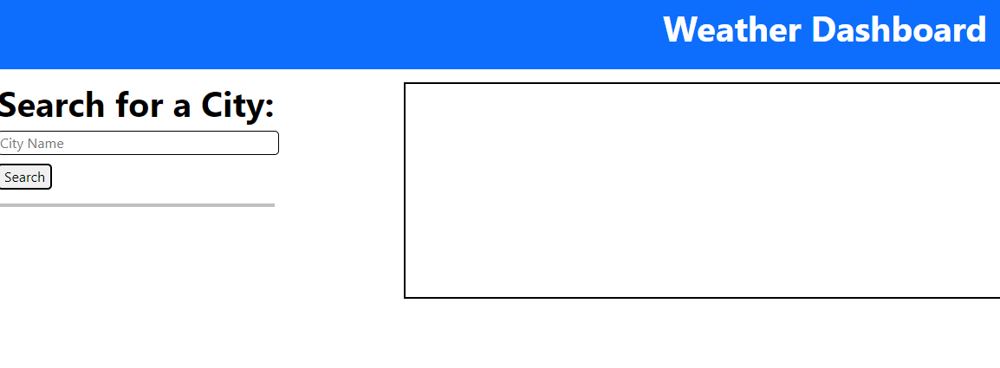

# WeatherDB
## Table of Contents
- [Project Descrition](#Description)
- [Install/Usage](#Installation)
- [Contributions](#Contributions)
- [Questions](#Questions)
- [License](#License)

## Description
A weather forecasting application that displays both the current weather and the weather forecast, as well as displaying recent searches.

## Installation
There is no installation required.

## Usage
Visit https://tmorgan1987.github.io/WeatherDB/, enter the city you want to see the current and future weather for, and click the search button.

## Contribution(s)
N/A

## Contact:
<a href = "mailto: tmorgan1987@outlook.com">Send Email</a>
 
<a url="https://github.com/tmorgan1987">Github</a>

## License
mit

